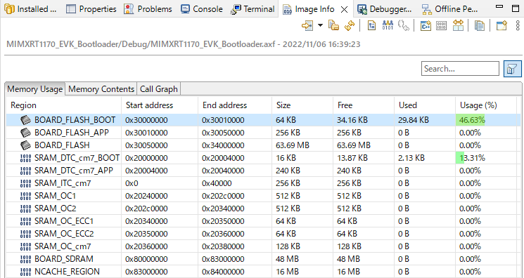
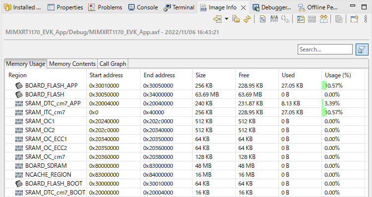
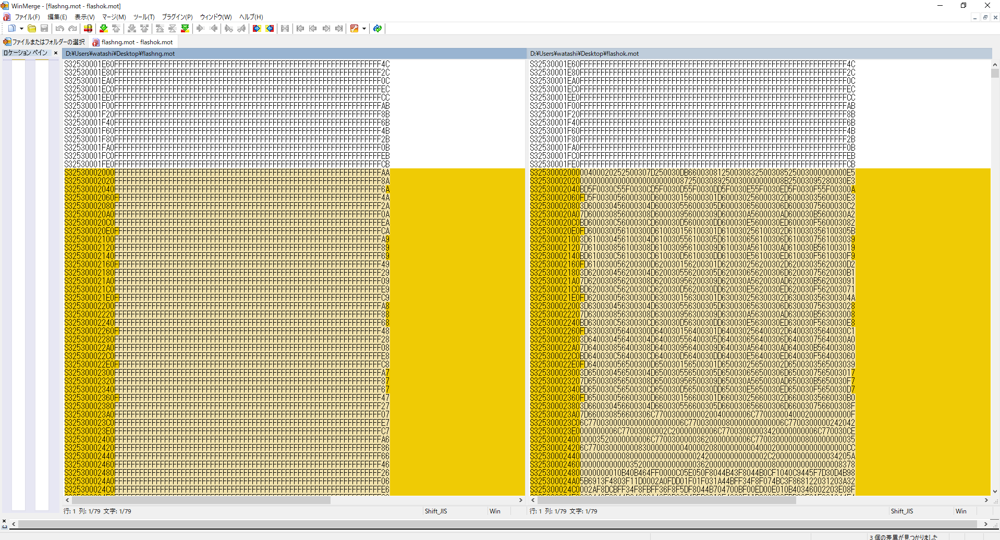
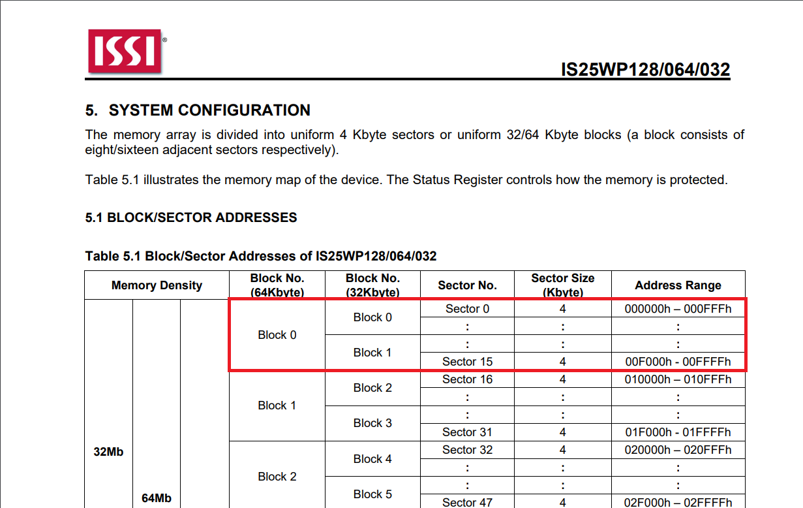

# RT117X_DebuggableBootloaderの概要
- MIMXRT117XのMCUにおいて、コードをITCMにて実行するsecondary bootloaderのサンプルです。
- RAM実行プロジェクトの開発環境を構築するための、学習用サンプルです。
- 評価ボード"MIMXRT1170-EVK"を利用して実行できます。

## 動作確認環境
次の環境で動作します。
- MIMXRT1170-EVK
- MCUXpresso IDE v11.6.0 [Build 8187] [2022-07-13]

## 内容
- 1つのワークスペースがあります。
  - workspace_MIMXRT1170EVK_Bootloader

- 2つのプロジェクトが含まれます。
   - MIMXRT1170_EVK_Bootloader
   - MIMXRT1170_EVK_App

それぞれは次のようにMCU上に配置されます。

# 使い方
1. MIMXRT1170_EVK_Bootloaderの書き込み
1.1. ワークスペース上で、MIMXRT1170_EVK_Bootloaderを開き、ビルドします。
1.2. デバッグを実行します。
(MIMXRT1170_EVK_Bootloader JLink Debug を用意しています。)
1.3. 実行すると何回か、250ms周期の比較的高速なLチカをして終了orリセットすると思います。
2. MIMXRT1170_EVK_App
2.1. ワークスペース上で、MIMXRT1170_EVK_Appを開き、ビルドします。
2.2. デバッグを実行します。
(MIMXRT1170_EVK_App JLink Debug を用意しています。)
2.3. 実行すると、ブートローダのLチカをしてから、App側にジャンプして1s周期の遅いLチカを始めます。

# ハマりポイント
環境を作成するにあたり、いくつかの(本質ではない)障害がありました。
ここに記録しておきます。

## .cppでのmain関数マングリング
mainの宣言がそのままだと、startup_mimxrt1176_cm7.cppでmain関数が見つからず、エラーとなります。
extern "C" int main(void) {
と記述して回避します。

## Flashの分割
Bootloaderを利用するときには、通常Bootloaderを設置する領域(以下BOOTとします。)と、
アプリケーションを設置する領域(以下APPとします。)にFlashをリンカスクリプト上にて分割します。

通常はBootloaderは僅かなコード量であるため、BOOTを小さく設定したくなりますが、
JLinkを使う場合に限っては、BOOTを64KB以下に設定してはいけません。

評価ボードに付属のMCULinkでは(64KB以下の設定時にも)正しく書き込みをしましたが、JLinkでは次の事が発生します。

### JLinkで発生する障害
次の手順を行います。
- BOOTを書き込む
- APPを書き込む

このとき、コード領域はそれぞれ重なり合ってないため、通常ならばFlashにはそれぞれが両立するはずです。
動作させたとき以下のようになります。

ブートローダが存在する箇所が(0x30002000以降)、FFで埋め尽くされています。
このような現象を回避するためには、BOOTを64KBとします。

今回利用しているFlash(QSPI Flash)である、IS25WP128のBlockと関係がある気がしますが、詳細はまだ分かっていません。(ご存知でしたら教えて下さい。)
